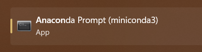

# Robovac
The main repo for Team 1's CS499 project

## Setting up your dev environment
We will be using python 11 with Pygame, Tkinter, and any other libraries we end up using

> **To make sure all of our environments are the same, we will use something called `Miniconda`. This will allow us to use a fresh environment without worrying about what other python things we have installed**

### Install and update Miniconda
Go [here](https://docs.conda.io/en/latest/miniconda.html) to install the correct Miniconda version for your system **Make sure you acccept the default settings**

On Windows, launch the program called Anaconda prompt. This will be your terminal



On Mac and Linux, just use your default terminal for all terminal commands

### Create a new Conda environment
This will create a new conda enviroment that we can install our packages in. To do this, run

```
conda create --name QTrobovac -c conda-forge black
```
Confirm with `y`

Then to switch to the new environment, run

```
conda activate robovac
```

Now you are in the new environment. To install the rest of the packages, run

```
pip install pyqt5
pip install PyQt5Designer
```
## How to run pyqt5 designer
To run pyqt5 designer, run

```
designer.exe
```
If this doesn't work, make sure that your
Python.xxScripts is in your PATH environment

## How to push your code

### 1. Make sure you are on the correct branch
You will do all of your work in your own branch. To create a new branch, run

```
git checkout -b <your branch name>
```

This will create a new branch and switch to it. 

To switch to an existing branch, run

```
git checkout <branch name>
```

If you want to switch to a branch that is not on your computer, run

```
git fetch origin
```
and then try to switch to the branch again

### 2. Make sure your code is formatted correctly
From the root of the project, run

```
black .
```
Note that this must be run from a terminal that has the conda robovac environment activated. On Windows, this will be the Anaconda Prompt. On Mac and Linux, this will be your default terminal.

Black will format your code to make sure it is consistent with the rest of the project. If you have any errors, you will need to fix them before you can merge your code.

### 3. Add your changes

Once you have made changes to your code, you will need to add them to a commit. To do this, run

```
git add *
```
from the root of the project. This will add all of your changes to the commit

### 4. Commit your changes

Once you have added your changes, you will need to commit them. To do this, run

```
git commit -m "<your commit message>"
```

### 5. Push your changes
Finally, you will push your changes to the remote repository. To do this, run

```
git push
```
## Adding Black to your conda environment
If you created your conda environment before we added black to the requirements, you will need to add it manually. To do this, run

```
conda install -c conda-forge black
```
And confirm with `y`